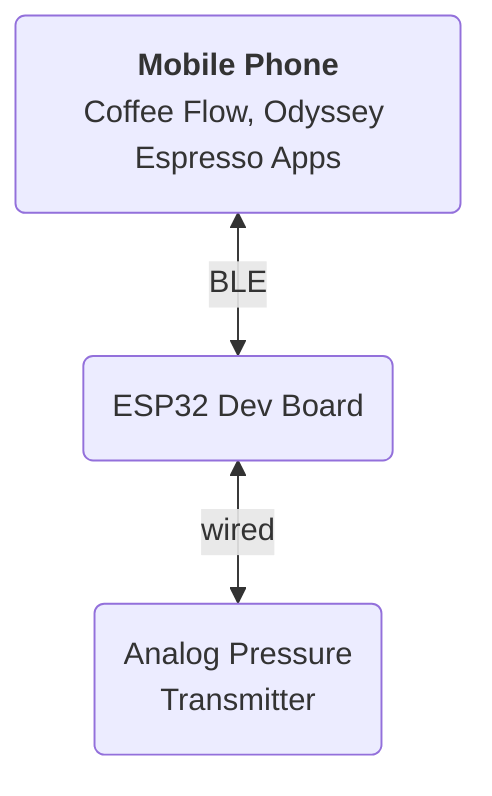

# Bluetooth Pressure Transducer
This is my Ramadhan 1444H side project. The idea was already floating in my mind, but I can't start the project because lack of free time. Purpose of this project is to create Bluetooth Pressure Transducer that can be connected to pressure profiling apps (Coffee Flow & Odyssey Espresso).

The target espresso machine was my Flair 58. This espresso maker is having G1/8 fitting for the pressure gauge.

## Diagram

## Bill of Material
This device consists of following components:
- ESP32 Dev board (WEMOS LOLIN32 OLED)
- Breadboard
- Analog Pressure Transmitter 5V DC

### ESP32 Dev board (WEMOS LOLIN32 OLED)
I'm using this board because there is OLED embedded in the board so we just need the programming part without having trouble to do wiring on display component.

The display component will be used to display the current status of the device. Whether connected to the app or not. Also to display current pressure reading by the analog pin.

### Analog Pressure Transmitter 5V DC
`WARNING: Make sure youre using high temperature version of the sensors before using it with your espresso machine`

The analog pressure transmitter wiring will have :
- 5V (power)
- Ground
- Output

### Wiring
From above schematic, we will need to connect Pressure Transmitter to `5V`, `GND` and some analog PIN (I choose `ADC13`/`GPIO15`).

### Code Part
I will decide whether to share the source code or not. At the moment I will put the binary in this repository.
