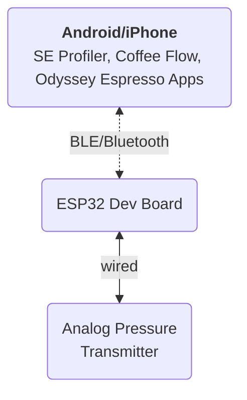

# Bluetooth Pressure Transducer
The purpose of this project is to create Bluetooth Pressure Transducer that can be connected to pressure profiling apps (SE Profiler, Coffee Flow & Odyssey Espresso).

The target espresso machine was my Flair 58. This espresso maker has a G1/8 fitting for the pressure gauge.


## Diagram
Following diagram depict the configuration of the current implementation.



## Bill of Material
This device consist of following components:
- ESP32 Dev board (WEMOS LOLIN32 OLED)
- Breadboard
- Analog Pressure Transmitter 5V DC

### ESP32 Dev board (WEMOS LOLIN32 OLED)
I'm using this board because there is OLED embedded in the board so we just need the programming part without having trouble to do wiring on display component.

The display component will be used to display the current status of the device. Whether connected to the app or not. Also to display current pressure reading by the analog pin.


### Analog Pressure Transmitter 5V DC
`WARNING: Make sure youre using high temperature version of the sensors before using it with your espresso machine`

The analog pressure transmitter wiring will have :
- 5V (power)
- Ground
- Output

### Wiring
From above schematic, we will need to connect Pressure Transmitter to `5V`, `GND` and some analog PIN (I choose `ADC19`/`GPIO26`).

### Code Part
At the moment I will put only the binary to this repository.

### Flashing Firmware using ESPTOOL
Download the binary provided in the release section. The binary will consists of following files:
1. `BluetoothPressureTransducer_InternalLCD.ino.bootloader.bin`
2. `BluetoothPressureTransducer_InternalLCD.ino.partitions.bin`
3. `BluetoothPressureTransducer_InternalLCD.ino.bin`
4. `boot_app0.bin` (this files should be provided by ESPTOOL during package installation - make sure your environment already have running Arduino IDE with ESP32 pack)

Run following command (some parts will need you to adjust to match your own environment):

```shell
{PATH_TO_ESPTOOL}/esptool --chip esp32 --port "{CHANGE_TO_YOUR_DEVICE_PORT}" --baud 115200  --before default_reset --after hard_reset write_flash  -z --flash_mode dio --flash_freq 80m --flash_size 4MB 0x1000 BluetoothPressureTransducer_InternalLCD.ino.bootloader.bin 0x8000 BluetoothPressureTransducer_InternalLCD.ino.partitions.bin 0xe000 "{PATH_TO_YOUR_ESP32_PACKAGE}/packages/esp32/hardware/esp32/2.0.7/tools/partitions/boot_app0.bin" 0x10000 BluetoothPressureTransducer_InternalLCD.ino.bin
```

For your reference, in my environment (OSX) will need to run using following parameters:
```shell
"/Users/sybond/Library/Arduino15/packages/esp32/tools/esptool_py/4.5.1/esptool" --chip esp32 --port "/dev/cu.usbserial-0001" --baud 115200  --before default_reset --after hard_reset write_flash  -z --flash_mode dio --flash_freq 80m --flash_size 4MB 0x1000 "/private/var/folders/pz/jkl6w3fs45v88wcck8qtfhw00000gn/T/arduino/sketches/4E4A8C476EDC2D7C933461960E7BD641/BluetoothPressureTransducer_InternalLCD.ino.bootloader.bin" 0x8000 "/private/var/folders/pz/jkl6w3fs45v88wcck8qtfhw00000gn/T/arduino/sketches/4E4A8C476EDC2D7C933461960E7BD641/BluetoothPressureTransducer_InternalLCD.ino.partitions.bin" 0xe000 "/Users/sybond/Library/Arduino15/packages/esp32/hardware/esp32/2.0.7/tools/partitions/boot_app0.bin" 0x10000 "/private/var/folders/pz/jkl6w3fs45v88wcck8qtfhw00000gn/T/arduino/sketches/4E4A8C476EDC2D7C933461960E7BD641/BluetoothPressureTransducer_InternalLCD.ino.bin"
```
Currently I have 2 versions of firmware:
1. For 0-200psi pressure transmitter
2. For 0-1,6MPa pressure transmitter (I recently purchase from [here](https://www.aliexpress.com/item/1005004559608411.html))
