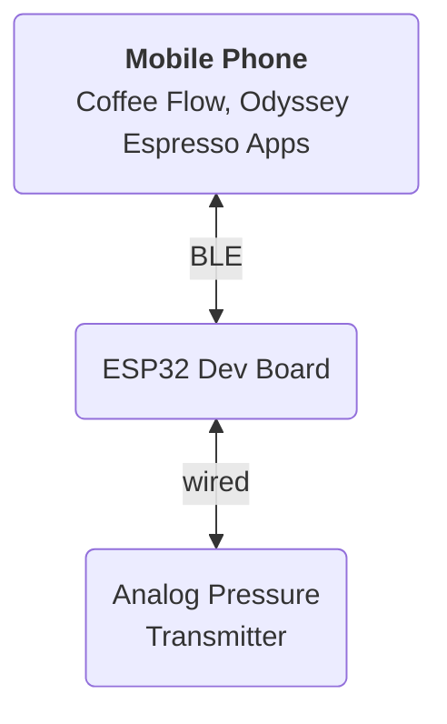

# Bluetooth Pressure Transducer
## Diagram

```mermaid
flowchart BT
    A(Analog Pressure\nTransmitter) <-->|wired| B(ESP32 Dev Board)
    B<-->|BLE|C(<b>Mobile Phone</b>\nCoffee Flow, Odyssey Espresso Apps)
```

## Bill of Material
This device consists of following component:
- ESP32 Dev board
- Breadboard
- Jumper wires
- Analog Pressure Transmitter 5V DC
